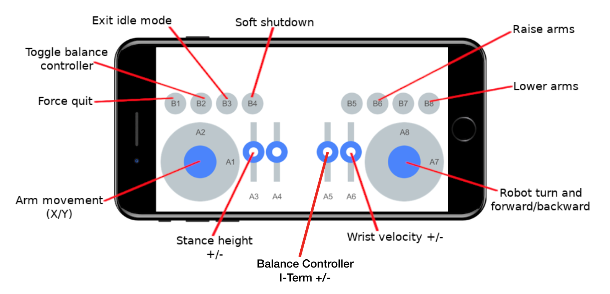

# Igor Balancing Robot MATLAB Demo

 HEBI Robotics
 March 2019
 Matlab 2013b (or later)

## Requirements

### Controller

The demo can be run using the Mobile IO app connected to the robot's wireless network or computer running the demo.

* Mobile IO (Requires HEBI's Mobile IO app on an Android or iOS device)

### Software Requirements 
* [HEBI MATLAB API](http://docs.hebi.us/tools.html#matlab-api)

## Running

To run the main demo code for Igor from Matlab:

- Open Matlab
- Navigate to this folder hebi-matlab-examples/kits/igor/
- Run startup.m
- Run igor2StartupIntegrated.m

Note: By default, the demo will look for a Mobile IO device with family `**HEBI**` and name `**Mobile IO**`.

## Controls

The demo provides default mappings for both supported controllers. You can modify them, if needed, by editing the `components/configuration.py` file directly.

### Mobile IO

The default Mobile IO mappings are as followed. 

NOTE: The layout of the application may appear different on your device than what is shown, but the buttons and axes are guaranteed across any device.

Almost all of control code for Igor is contained within __**igor2DemoIntegrated.m**__.  

The function will look for modules, look for a controller, and then start the demo by pressing the B3 Button. 

After starting the demo with B3, the robot will standup partially and start balancing. Move slider A3 up to stand up the rest way. Return the slider back to the center to stop sending commands. There is a deadzone of 20% in each direction for the sliders.  

HOLD DOWN THE B4 BUTTON TO END THE DEMO. The robot will squat down and exit the main loop when it hits the bottom of the leg travel. The robot will then wait for the B3 Button to restart the demo.

NOTE: If the Mobile IO app closes or disconnects while the demo is running the last commands sent will continue to be sent. That is, the robot will either maintain it's current balancing position OR continue moving in the commanded manner.

## Autostart

To run the main demo automatically, there are scripts provided:

- igorStart.sh - A shell script for Linux
- igorStart.bat - A batch file for Windows

Both of these scripts may need to be modified so that the paths to Matlab or the Igor code directory match the path on your machine.
