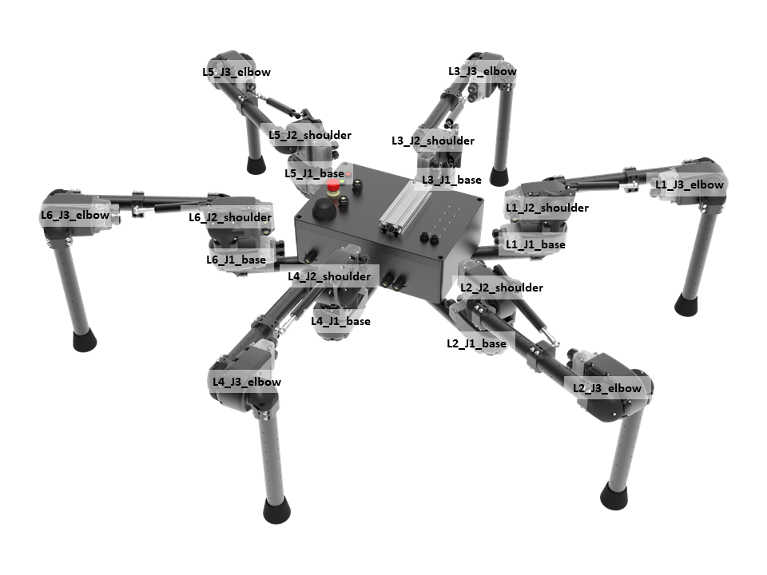
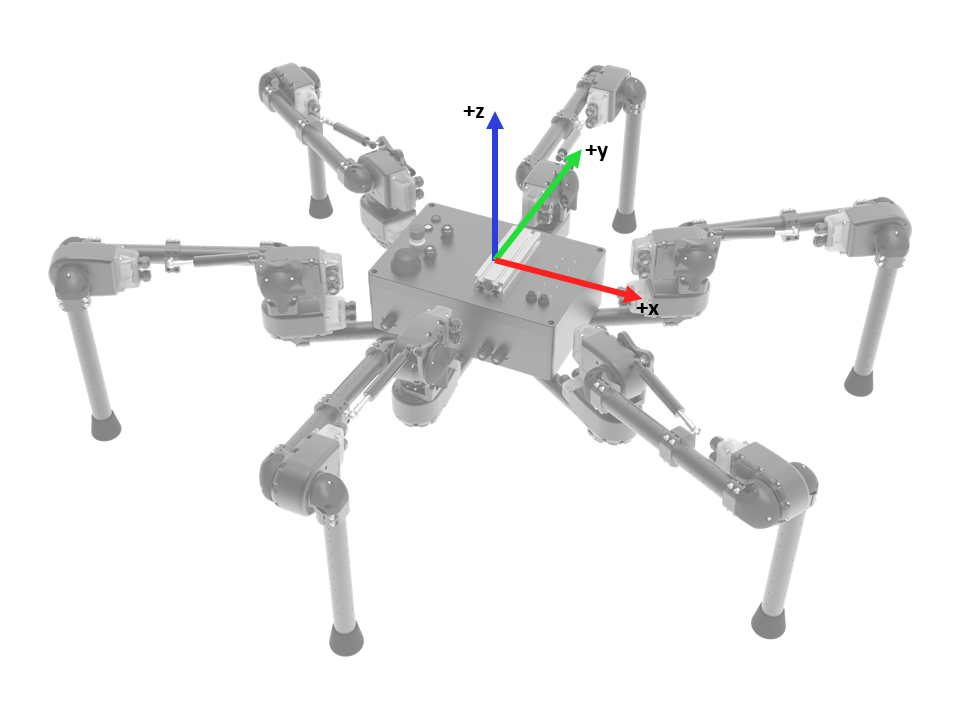

# Lily Robot Kit

This folder contains everything needed to run the Lily hexapod kit.  It assumes that you have:
* Lily Robot Kit (fully assembled)
* iOS or Android mobile device (phone or tablet)

## Unpacking Lily
The robot ships folded and packed in a single Pelican Case.  

Included in the case is:
- Lily Robot
- Gas Springs (6x)
- Batteries (4x)
- Chargers (2x)
- WiFi Antenna

## Assembling / Setting Up Lily
If you are assembling Lily, you can follow the assembly instructions found at:
http://docs.hebi.us/resources/kits/assyInstructions/R-Series_Hexapod.pdf

The actuators in each leg will need to be named `base#`, `shoulder#`, `elbow#`, with the numbering convention for the legs matching the image above.  The Family for all of the actuators in the robot needs to be set to `Lily`.   You can set the Family/Name of the actuators using [Scope](http://docs.hebi.us/tools.html#scope-gui).

Gains, control parameters, and kinematic information are all set automatically in the demo code.  If you want to view or change these parameters you can refer to the files below.  
- Individual actuator gains are the same for each leg, and can be found in [lilyLeg-Gains.xml](gains/lilyLeg-Gains.xml).
- The HRDF files that define the kinematics of the robot can be found in the [hrdf/](hrdf/) folder.

## Starting Lily Demo Code

#### Powering up the robot:
- There are 2 batteries that fit into the sealed chassis of the robot.  When both batteries are plugged in they will share the load equally.  You can also plug the battery charger in while running for tethered operation.
- [Turn on the batteries](https://www.ebikes.ca/product-info/ligo-batteries.html) by pressing and holding the 'Battery On/Off' buttons until the lights flash green.
- After the batteries turn on, you will hear 2 beeps, followed by 2 double-beeps as the router in the robot powers up.
- Press and hold the green button labeled 'Actuator On/Off'.  When the power to the actuators turns on the button will turn green.
- Turn on the power to the onboard computer with the red button labeled 'Computer On/Off'.  When the power to the computer turns on the button will turn red.  *The computer does not need to be on for the modules in the robot to be seen on the network.*
- Make sure the M-Stop button is off (not pressed in).

#### Getting the robot ready to run:
- **Make sure all of the legs are within their joint limits.** The [status LEDs](http://docs.hebi.us/core_concepts.html#led-status-codes) on the actuators will blink orange if the module is outside the joint limit.  When the actuators rotate to within their joint limits, the LEDs will change to a slow green fade.  The joints that will have to be rotated the most will be the ankle joints.  
- You can also use [Scope](http://docs.hebi.us/tools.html#scope-gui) to check the position feedback and limits on each joint.
- You can connect to the modules on the robot directly from an external computer by accessing the robot's WiFi network (default password `hebi1234`) or by plugging into the ethernet port on the back of the robot.  **If you are controlling the robot from an external computer, you should always use the wired ethernet connection.**

#### Connecting a Mobile Device for Control:
- The code to control the robot assumes that a mobile device is on the network running the [HEBI Mobile I/O App](http://docs.hebi.us/tools.html#mobile-io).  The device will need to be on the same network as the robot (usually connected to the robot's WiFi network), and it will need to be set to the Family `Lily` and the Name `_Controller`.  You can set the Family/Name of the mobile device in [Scope](http://docs.hebi.us/tools.html#scope-gui), or in the settings for the app on the mobile device.

## To get started:
* Download this folder
* Start Matlab (2013b or later)
* run `startup.m`
* run `lilyDemo.m`

The demo will start up looking for the actuators in the robot, followed by the mobile device for input.  The border of the HEBI Mobile I/O app will hightlight green when it is connected and the demo starts.

## Coordinate frame convention

* `X` = forward (from driver's perspective)
* `Y` = left (from driver's perspective)
* `Theta` = counter-clockwise rotation

## Input Controls

| Input      | Command   | Note  |
| ----------------- | ----------------- | ----------- |
| Right Joystick (`A8` and `A7`)  | Base X-Y Velocity (forward/back, left/right) |  |
| Left Joystick (`A1`) | Base Theta Velocity (turning) |  |
| Slider (`A3`) | Chassis Z Velocity (body height up and down) |  | 
| Button (`B1`) | Toggle Stance Mode / Step Mode | When in stance mode the robot chassis will shift around due to the joystick velocity commands, but the feet will not move.  The button is blue when in stance mode. |
| Button (`B8`) | Exit the demo. | The border of the the HEBI Mobile I/O app will no longer be highlighted green after exiting. |

Note that even though the image above notes 'Pitch', the Matlab demo does not currently control pitch.

## Automatic startup instructions for Linux

This process was tested using Ubuntu 16.04.

The folder also contains scripts designed to automatically launch the demo. `lilyStart.sh` is used to launch Matlab and start the script.  The `install.sh` script will create a symbolic link to `lilyStart.sh` so that the user can simply type `lilyStart` into a terminal window and the Matlab script will execute.

To install:
* Open a command prompt and navigate to the top level `lily` kit directory
* Make sure that the `install.sh` script has execute permissions: `chmod +x install.sh`
* Run `install.sh`: `./install.sh`

If you would like to have the script start on boot, add the `lilyStart` command under `Startup Applications` if using Ubuntu or use another standard method for automatically launching the program.

Note that if you move the location of `lilyStart.sh` you will have to delete the symbolic link from `/usr/bin` and run `install.sh` again.